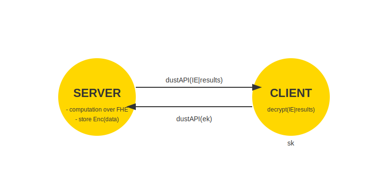

# DustAPI - A Fast, Lightweight Python Web Framework

DustAPI is a lightweight web framework written in Python, designed to be simple, efficient, and easy to use. It provides basic routing and response handling, making it an excellent choice for learning about web frameworks or building small to medium-sized web applications.



## Features

- Simple and intuitive routing
- Searchable symmetric encryption (dust server can search encrypted data without decrypting it)
- Support for all HTTP methods (GET, POST, PUT, DELETE, etc.)
- WebSocket support
- Custom response types (JSON, HTML, etc.)
- Extensible and lightweight
- Auto-generate API documentation with Swagger
- JWT and session management support
- Asynchronous request handling

## Installation

To install DustAPI, use pip:

```bash
pip install dustapi
```

## Quick Start

### Create a DustAPI project

```bash
dustapi createproject myproject
cd myproject
```

### Run the DustAPI server

```bash
dustapi runserver --host 0.0.0.0 --port 8000 --template-folder templates --static-folder static --log-file app.log
```

### Example Application

```python
from dustapi.application import Dust, get_request
from dustapi.responses import JsonResponse, Response
import os

app = Dust()

UPLOAD_FOLDER = 'uploads'
os.makedirs(UPLOAD_FOLDER, exist_ok=True)

def save_uploaded_file(file_data, upload_folder):
    filename = file_data['filename']
    filepath = os.path.join(upload_folder, filename)
    with open(filepath, 'wb') as f:
        f.write(file_data['content'])
    return filename

@app.route('/', methods=['GET'])
async def home():
    return app.render_template('index.html', title="Home", heading="Welcome to DustAPI", content="This is the home page.")

@app.route('/hello', methods=['GET'])
async def hello():
    return "Hello, World!"

@app.route('/json', methods=['GET'])
async def json_example():
    return JsonResponse({"message": "This is a JSON response"})

@app.route('/upload', methods=['POST'])
async def upload_file():
    request = get_request()
    if 'file' not in request.form:
        raise ValueError("No file part in the request")
    
    file_data = request.form['file']
    filename = save_uploaded_file(file_data, UPLOAD_FOLDER)
    return f"File {filename} uploaded successfully"

@app.errorhandler(ValueError)
def handle_value_error(exc):
    return Response(str(exc), status=400)

@app.errorhandler(Exception)
def handle_generic_exception(exc):
    return Response("An unexpected error occurred.", status=500)

if __name__ == '__main__':
    app.run(host='localhost', port=5000)

```

## Documentation

For detailed documentation, visit our [official documentation site](https://dustapi.readthedocs.io).

## Contributing

We welcome contributions! Please see our [Contributing Guide](CONTRIBUTING.md) for more details.

## Roadmap

- [ ] AI/ML model inference and consumption
- [ ] Middleware support
- [ ] Database ORM integration
- [ ] Improved WebSocket support
- [ ] CLI tools for project scaffolding

## License

DustAPI is released under the MIT License. See the [LICENSE](LICENSE) file for details.

## Support

If you encounter any issues or have questions, please [open an issue](https://github.com/godwins3/dustapi/issues) on our GitHub repository.
